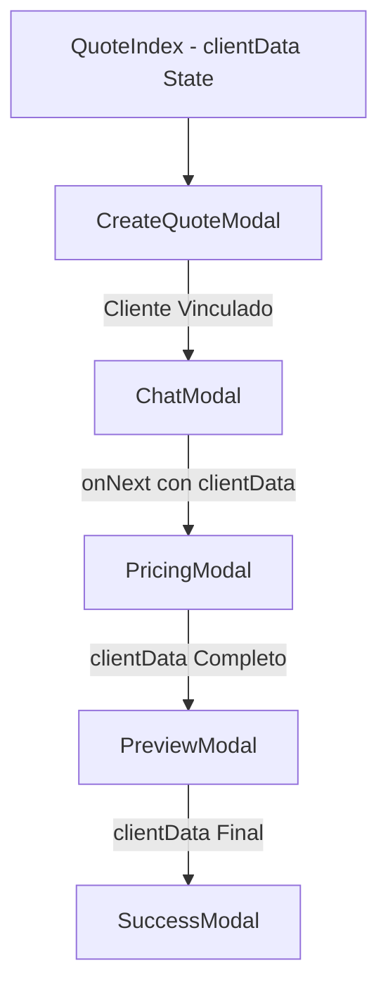

# 🔗 Flujo de Información del Cliente - Sistema React

## ✅ Flujo Completo Implementado

### 1. **CreateQuoteModal** - Búsqueda y Vinculación
- **Función**: Búsqueda en tiempo real de clientes
- **Resultado**: Vinculación completa del cliente
- **Datos Capturados**:
  ```jsx
  clientData: {
    // IDs y referencias
    clientId: client.id,
    search: client.documento,
    documentClient: client.documento,
    
    // Información básica
    clientName: client.cliente,
    clientCompanyName: client.cliente,
    
    // Contacto
    clientEmail: client.email,
    clientPhoneNumbers: client.telefono,
    clientPersonalCell: client.celular,
    
    // Ubicación y detalles
    clientLocation: client.ciudad,
    clientAddress: client.direccion,
    clientBranchOffice: client.branch_office,
    clientSalesRepresentative: client.vendedor_nombre,
    
    // Configuración de cotización
    clientType: '', // 'credit' | 'cash'
    operationType: '', // 'EXPORTACIÓN' | etc.
    typeBusiness: '' // 'OTM' | etc.
  }
  ```

### 2. **ChatModal** - Configuración con Cliente Vinculado
- **Visualización**:
  - ✅ Badge "CLIENTE VINCULADO" en verde
  - ✅ NIT del cliente
  - ✅ Ubicación con icono 📍
  - ✅ Email con icono ✉️
  - ✅ Estado "En Proceso"
- **Funcionalidad**: Chat AI con contexto del cliente

### 3. **PricingModal** - Configuración de Precios con Relación Completa
- **Header Mejorado**:
  - ✅ Título con nombre del cliente
  - ✅ Badge "CLIENTE VINCULADO" 
  - ✅ NIT con formato visual
  - ✅ Ubicación con icono de localización
  - ✅ Email con icono de correo
  - ✅ Representante de ventas con icono de persona
- **Estado**: "Configurando Pricing"

## 🎯 Información Contextual por Modal

### **CreateQuoteModal**
```jsx
// Búsqueda activa
{clientData.search && !clientData.clientId && (
  <div>Resultados de búsqueda...</div>
)}

// Cliente encontrado
{clientData.clientId && (
  <div className="bg-green-50 border border-green-200">
    <span className="bg-green-100 text-green-800">Cliente encontrado</span>
    <p>Empresa: {clientData.clientName}</p>
    <p>NIT: {clientData.documentClient}</p>
    <p>Ciudad: {clientData.clientLocation}</p>
    <p>Email: {clientData.clientEmail}</p>
  </div>
)}
```

### **ChatModal**
```jsx
// Header del cliente
<h3>{clientData.clientName || clientData.search || 'Nueva Cotización'}</h3>
<p>
  {clientData.clientId ? (
    <span>
      <span className="bg-green-100">CLIENTE VINCULADO</span>
      {clientData.documentClient}
    </span>
  ) : (
    clientData.clientName || 'Cliente'
  )}
</p>
{clientData.clientLocation && <p>📍 {clientData.clientLocation}</p>}
{clientData.clientEmail && <p>✉️ {clientData.clientEmail}</p>}
```

### **PricingModal**
```jsx
// Header expandido del cliente
<h3>{clientData.clientName || clientData.search || 'Creación de cotización'}</h3>
{clientData.clientId ? (
  <>
    <span className="bg-green-100">CLIENTE VINCULADO</span>
    <span>NIT: {clientData.documentClient}</span>
    
    {clientData.clientLocation && (
      <p>📍 {clientData.clientLocation}</p>
    )}
    
    {clientData.clientEmail && (
      <p>✉️ {clientData.clientEmail}</p>
    )}
    
    {clientData.clientSalesRepresentative && (
      <p>👤 Representante: {clientData.clientSalesRepresentative}</p>
    )}
  </>
) : (
  <p>{clientData.documentClient} | {clientData.clientName || 'Cliente nuevo'}</p>
)}
```

## 🔄 Propagación de Datos

### **Flujo de Estado**


### **Props Pasadas**
```jsx
// QuoteIndex.jsx - Estado central
const [clientData, setClientData] = useState({...});

// CreateQuoteModal
<CreateQuoteModal 
  clientData={clientData}
  setClientData={setClientData}
/>

// ChatModal  
<ChatModal 
  clientData={clientData}
/>

// PricingModal
<PricingModal 
  clientData={clientData}
/>
```

## 🎨 Estados Visuales

### **Cliente NO Vinculado**
- **CreateQuoteModal**: Campo de búsqueda vacío
- **ChatModal**: "Cliente" genérico
- **PricingModal**: "Cliente nuevo"

### **Cliente EN BÚSQUEDA**
- **CreateQuoteModal**: Loading spinner + dropdown resultados
- **Estado**: Transitorio durante búsqueda

### **Cliente VINCULADO**
- **Todos los Modales**: Badge verde "CLIENTE VINCULADO"
- **Información Completa**: NIT, ubicación, email, representante
- **Estado Persistente**: Se mantiene durante todo el flujo

## 🔧 Funcionalidades Implementadas

### **Búsqueda Inteligente**
- ✅ Activación desde 3 caracteres
- ✅ Búsqueda por NIT y nombre
- ✅ Resultados en tiempo real
- ✅ Selección con click

### **Vinculación Automática**
- ✅ Carga completa de datos del cliente
- ✅ Propagación automática entre modales
- ✅ Persistencia durante el flujo
- ✅ Estados visuales diferenciados

### **Información Contextual**
- ✅ Badge de estado "CLIENTE VINCULADO"
- ✅ Iconos para diferentes tipos de información
- ✅ Información expandida en cada modal
- ✅ Representante de ventas visible

## 📊 Datos Disponibles en Cada Modal

| Campo | CreateQuoteModal | ChatModal | PricingModal |
|-------|------------------|-----------|--------------|
| clientId | ✅ | ✅ | ✅ |
| clientName | ✅ | ✅ | ✅ |
| documentClient | ✅ | ✅ | ✅ |
| clientLocation | ✅ | ✅ | ✅ |
| clientEmail | ✅ | ✅ | ✅ |
| clientSalesRepresentative | ✅ | ❌ | ✅ |
| clientPhoneNumbers | ✅ | ❌ | ❌ |
| clientAddress | ✅ | ❌ | ❌ |
| clientBranchOffice | ✅ | ❌ | ❌ |

## 🚀 Resultado Final

### **Experiencia Usuario**
1. **Buscar**: Escribir NIT/nombre → Resultados inmediatos
2. **Vincular**: Click en cliente → Datos cargados automáticamente  
3. **Visualizar**: Badge "CLIENTE VINCULADO" en todos los modales
4. **Contextualizar**: Información completa disponible en cada paso

### **Beneficios Técnicos**
- ✅ Estado centralizado en QuoteIndex
- ✅ Props drilling controlado y eficiente
- ✅ Información contextual rica
- ✅ Estados visuales claros
- ✅ Flujo de datos predecible

---
**Estado**: 🟢 COMPLETADO - Relación del cliente propagada exitosamente
**Build**: ✅ quotes-react-2a81c70a.js (90.57 kB)
**Flujo**: CreateQuoteModal → ChatModal → PricingModal (con cliente vinculado)