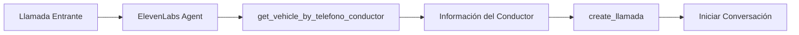
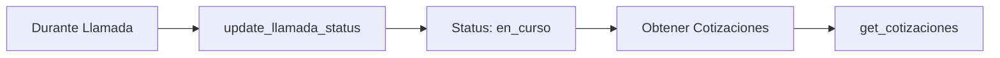
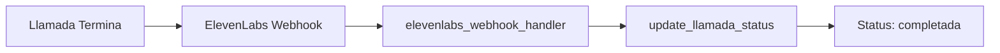

# Guía de Integración con ElevenLabs

## 🎯 Configuración del Servidor MCP en ElevenLabs

### 1. Configuración en ElevenLabs

Para integrar el servidor MCP de Conalca con ElevenLabs, añade la siguiente configuración:

```json
{
  "mcpServers": {
    "conalca-transport": {
      "command": "python",
      "args": ["-m", "conalca_mcp_server.server"],
      "cwd": "/root/conalca-mcp/mcp-server",
      "env": {
        "PYTHONPATH": "/root/conalca-mcp/mcp-server",
        "VIRTUAL_ENV": "/root/conalca-mcp/mcp-server/venv"
      }
    }
  }
}
```

### 2. Activación del Entorno Virtual

Asegúrate de que ElevenLabs use el entorno virtual:

```bash
# Script de activación automática
#!/bin/bash
cd /root/conalca-mcp/mcp-server
source venv/bin/activate
python -m conalca_mcp_server.server
```

## 🔧 Herramientas Disponibles para ElevenLabs

### Herramientas de Llamadas

#### `get_llamadas`
Lista las llamadas con paginación.
```json
{
  "name": "get_llamadas",
  "parameters": {
    "limit": 100,
    "offset": 0
  }
}
```

#### `get_llamada_by_id`
Obtiene una llamada específica.
```json
{
  "name": "get_llamada_by_id",
  "parameters": {
    "id_llamada": 35
  }
}
```

#### `create_llamada`
Crea una nueva llamada (útil cuando ElevenLabs inicia una llamada).
```json
{
  "name": "create_llamada",
  "parameters": {
    "id_cotizacion": 59,
    "chofer_id": 965,
    "status": "iniciada"
  }
}
```

#### `update_llamada_status`
Actualiza el estado de una llamada.
```json
{
  "name": "update_llamada_status",
  "parameters": {
    "id_llamada": 35,
    "status": "completada",
    "call_notes": "Llamada finalizada exitosamente"
  }
}
```

### Herramientas de Vehículos

#### `get_vehicle_by_telefono_conductor`
**Muy útil para ElevenLabs**: Busca información del conductor por teléfono.
```json
{
  "name": "get_vehicle_by_telefono_conductor",
  "parameters": {
    "telefono": "+573123456789"
  }
}
```

### Herramientas de Cotizaciones

#### `get_cotizaciones`
Lista las cotizaciones disponibles.
```json
{
  "name": "get_cotizaciones",
  "parameters": {
    "limit": 50,
    "offset": 0
  }
}
```

### Integración con ElevenLabs

#### `elevenlabs_webhook_handler`
**Fundamental**: Procesa webhooks de ElevenLabs para actualizar estados.
```json
{
  "name": "elevenlabs_webhook_handler",
  "parameters": {
    "conversation_id": "conv_5301k67bdbqzft0anh01xc2y1qp6",
    "status": "completada",
    "call_data": {
      "duration": 180,
      "outcome": "success",
      "cost": 0.05
    }
  }
}
```

## 🚀 Flujo de Trabajo con ElevenLabs

### 1. Llamada Entrante


### 2. Durante la Llamada


### 3. Finalizar Llamada


## 📝 Ejemplo de Implementación en ElevenLabs

### Agente de IA para Llamadas de Transporte

```javascript
// Configuración del agente ElevenLabs
const agent = {
  name: "Conalca Transport Agent",
  voice: "Rachel",
  tools: [
    "get_vehicle_by_telefono_conductor",
    "create_llamada", 
    "update_llamada_status",
    "get_cotizaciones",
    "elevenlabs_webhook_handler"
  ],
  instructions: `
    Eres un asistente de Conalca para gestionar llamadas de transporte.
    
    Al recibir una llamada:
    1. Obtén información del conductor usando su teléfono
    2. Crea una nueva llamada en el sistema
    3. Consulta cotizaciones disponibles
    4. Actualiza el estado según el progreso
    
    Sé profesional y eficiente en tus respuestas.
  `
};
```

### Script de Ejemplo para Conversación

```python
# Ejemplo de lógica en el agente
async def handle_incoming_call(phone_number):
    # 1. Buscar conductor
    vehicle_info = await call_mcp_tool(
        "get_vehicle_by_telefono_conductor",
        {"telefono": phone_number}
    )
    
    if vehicle_info:
        # 2. Crear llamada
        call_id = await call_mcp_tool(
            "create_llamada",
            {
                "id_cotizacion": get_active_quotation(),
                "chofer_id": vehicle_info["chofer_id"],
                "status": "iniciada"
            }
        )
        
        # 3. Continuar conversación...
        return f"Hola {vehicle_info['conductor']}, tengo información sobre tu solicitud de transporte."
    else:
        return "Lo siento, no encuentro tu información en nuestro sistema."
```

## 🔒 Configuración de Seguridad

### Variables de Entorno Requeridas
```bash
# Base de datos
DB_HOST=127.0.0.1
DB_PORT=3306
DB_DATABASE=ai_transport
DB_USERNAME=biosanar_user
DB_PASSWORD=your_password

# ElevenLabs (si es necesario)
ELEVENLABS_API_KEY=your_api_key
ELEVENLABS_WEBHOOK_SECRET=your_webhook_secret
```

### Permisos de Base de Datos
El usuario de base de datos debe tener permisos para:
- SELECT en `llamadas`, `cotizacion_models`, `vehicle_owner_holder_driver`
- INSERT, UPDATE en `llamadas`

## 📊 Monitoreo y Logs

### Logs del Servidor
El servidor genera logs detallados en:
- Conexiones a la base de datos
- Ejecución de herramientas MCP
- Webhooks de ElevenLabs
- Errores y excepciones

### Métricas Recomendadas
- Número de llamadas procesadas
- Tiempo de respuesta de herramientas MCP
- Errores de conexión a BD
- Webhooks recibidos de ElevenLabs

## 🆘 Troubleshooting

### Error: "Server object has no attribute 'tool'"
- Verificar versión de MCP: `pip show mcp`
- Usar la API correcta para MCP 1.15+

### Error: "Can't connect to MySQL server"
- Verificar que MySQL está ejecutándose
- Comprobar credenciales en `.env`
- Verificar conectividad de red

### Error: "Herramienta no encontrada"
- Verificar que el servidor MCP está correctamente configurado en ElevenLabs
- Comprobar que las herramientas están registradas

### Error de Webhooks
- Verificar que el `conversation_id` existe en la base de datos
- Comprobar formato del payload del webhook

## 📞 Soporte

Para soporte técnico:
- Revisa los logs del servidor: `/var/log/conalca-mcp.log`
- Ejecuta las pruebas: `python test_server.py`
- Verifica ejemplos: `python example_usage.py`